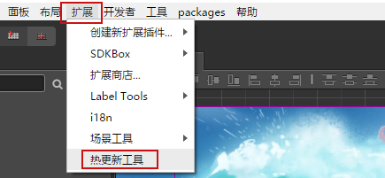
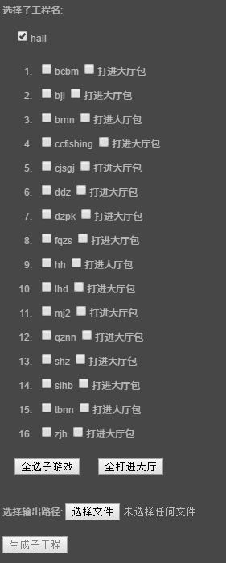
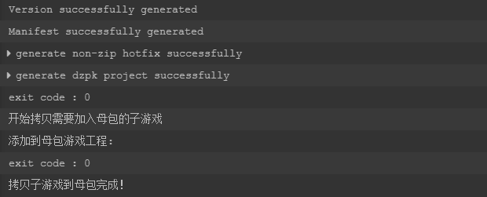

# 热更包生成及发布流程 V1.0
本文为 1.0 版本热更新工具的使用说明及操作流程描述，热更新工具现已优化至 2.0 版本，请移步至[热更包生成及发布流程 V2.0](热更包生成及发布流程 V2.0)阅读相关说明
## 1.  准备
### 更新相关SVN目录
热更包生成及发布涉及到的目录有：
*  creatorMainProj/packages/
*  devTool/

这些目录都是从 svn://192.168.1.242/app_client/branches/hotfix_dev 外链出来的。  
**使用插件生成和发布热更包前请务必先在对应工程下更新这些目录。**

### 安装 python
工具依赖 python2，推荐安装python2.7(32位)，https://www.python.org/downloads/ ，请自行安装。（好像 python3 也可以）

### 安装 nodejs
工具依赖 nodejs，推荐安装LTS版本，https://nodejs.org/en/ ，请自行安装。

## 2.  配置热更新插件
### 配置文件描述
每个工程下的 *creatorMainProj/packages/scenetools* 目录下保存有用于生成热更新包的插件，其中 *config.json* 即为热更新插件配置，其结构如下：  

    "creatorPath": "C:/CocosCreator_2.0.10/CocosCreator.exe",  
    "creatorPathMac": "/Applications/CocosCreator.app/Contents/MacOS/CocosCreator",  
    "updateUrl": "http://192.168.1.245/update_dev/",
    "versionGenScriptPath": "C:/Work/DH/app_client/branches/hotfix_dev/devTool/hotfix_tool/version_generator.js",  
    "encryptScriptPath": "C:/Work/DH/app_client/branches/hotfix_dev/devTool/encrypt_tool/encode.py",  
    "encryptEnabled":false,  
    "serverCfg":"192.168.1.243:20001",  
    "versionMap":{  
        "hall":"2.0.3",  
        "bcbm":"2.0.3",  
        "bjl":"2.0.3",  
        "brnn":"2.0.3",  
        "ccfishing":"2.0.3",  
        "cjsgj":"2.0.3",  
        "ddz":"2.0.3",  
        "fqzs":"2.0.3",  
        "hh":"2.0.3",  
        "lhd":"2.0.3",  
        "shz":"2.0.3",  
        "tbnn":"2.0.3",  
        "zjh":"2.0.3"  
    },  
    "channel":["123456@12@1"],  
    "tinyPngEnabled":false,  
    "tinyPngAPIKey":"326jHX0xSPZM7TdvRQQkMlWtk3N1Qb5Y"  

*  creatorPath 为 Windows 下编辑器可执行文件 CocosCreator.exe 的路径
*  creatorPathMac 为 MacOS 下编辑器可执行文件的路径
*  updateUrl 为存放热更包和程序检验热更新的地址
*  versionGenScriptPath 和 encryptScriptPath 为生成热更包和加密的工具
*  encryptEnabled 为是否进行加密的标志
*  serverCfg 为 socket 连接服务器的 IP 及端口
*  versionMap 分别是各个子游戏的热更新版本
*  channel 为渠道标识
*  tinyPngEnabled 为是否进行资源压缩的标志
*  tinyPngAPIKey 为使用 tinyPng 压缩图片时需要的 APIKey

### 配置规范
*  根据各自的开发环境配置 creatorPath、versionGenScriptPath、encryptScriptPath 字段
*  根据发布的需求配置 updateUrl 和 serverCfg 字段
*  根据需要配置需要发布的子游戏的热更新版本号，**注意不要随意更改无关的小游戏的版本号，只更改自己要发布的游戏即可**
*  其他配置一般情况下不需要变动

#### 特别注意
目前各环境的 updateUrl 和 serverCfg 为：  
  * 开发环境 updateUrl 为 http://192.168.1.245/update_dev/ ，serverCfg 为 192.168.1.243:20001  
  * 测试环境 updateUrl 为 http://192.168.1.245/update/ ，serverCfg 为 192.168.1.204:20001  
  * 产品环境 updateUrl 为 http://192.168.1.245/update_product/ ，serverCfg 为 192.168.1.242:21002  
  * 注意：
    * **updateUrl 与 serverCfg 配置一定要按照以上描述一一对应！**
    * **后期的路径可能会进行调整，届时将会同步此文档。**
    * **这个配置文件不要提交，各个项目组的客户端开发人员根据自己的发包需求进行改动即可。**
    * **updateUrl 配置中 ‘http://’ 前缀不能去掉，结尾斜杠不能少。**

## 3.  热更新插件的使用
### 入口

打开后界面如下：

### 生成热更新包
* 勾选需要制作热更包的模块
* hall 也算一个模块，不制作大厅热更包时不用勾选 hall
* 不要勾选打进大厅包选项
* 然后在“选择输出路径”处设置好热更包的输出路径
* 然后点击“生成子工程”按钮，随后编辑器的控制台会有输出
* 约 5 分钟左右的时间，控制台有类似以下输出则表示成功输出了热更包：

**生成的过程中若出现红色的报错可以咨询平台组-司马懿，有些错误可以忽略，有些不能。**  

### 输出目录描述
生成的热更包路径是： %输出目录%\updateProjs\update\\%游戏名称%\游戏名称_版本号.zip 

## 4. 发布热更新包
### 发布路径
使用 Xftp 工具连接服务器 192.168.1.245 的 22 号端口，用户名：root，密码：88888888 
*  开发环境发布路径为 /home/www/html/update_dev/%游戏名称%/  
*  测试环境发布路径为 /home/www/html/update/%游戏名称%/  
*  产品环境发布路径为 /home/www/html/update_product/%游戏名称%/  
### 拷贝和解压
使用 Xftp 工具将生成的热更包拷贝到对应环境的发布路径下，使用 Xshell 工具进入到发布路径下，用 unzip 命令解压拷贝进去的热更包，若提示重名覆盖即可。
### 更改 versionMap.json 
进入发布目录的父目录，其中有个 versionMap.json 文件用来描述大厅中子游戏更新的红点提示，其结构如下：

    "ddz": "8.0.1",  
    "lhd": "8.0.1",  
    "zjh": "8.0.1",  
    "ccfishing": "8.0.1",  
    "shz": "8.0.1",  
    "bjl": "8.0.1",  
    "bcbm": "8.0.1",  
    "hh": "8.0.1",  
    "cjsgj": "8.0.1",  
    "fqzs": "8.0.1",  
    "tbnn": "8.0.1",  
    "brnn": "8.0.1",  
    "hall": "8.0.1"  

其中 key 表示游戏名称，value 表示该游戏表示当前发布的版本，修改对应游戏的版本号为发布的版本。  
**注意不要忘记修改 versionMap.json 文件，也不要随意修改其他游戏的版本号。**

## 5. 验证
经过以上步骤，热更新包就发布成功了，在测试和产品环境发布热更新和通知测试和策划人员之前，请务必首先在开发环境用安卓模拟器或手机自行验证，确认没有问题再往测试和产品环境发布。  
若出现问题，先对照本文档检查是否有操作失误，若没有操作失误则及时将问题报告平台组。

* 开发环境母包：http://192.168.1.245/download/dev/
* 测试环境母包：http://192.168.1.245/download/test/
* 产品环境母包：http://192.168.1.245/download/product/